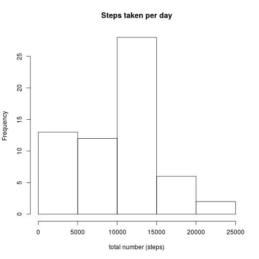
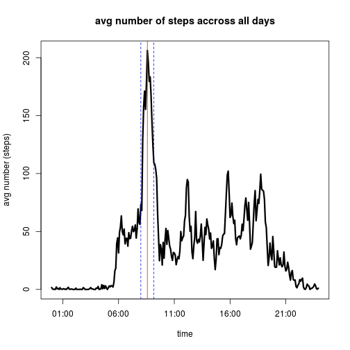
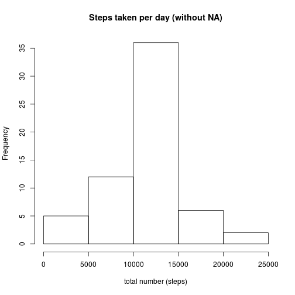
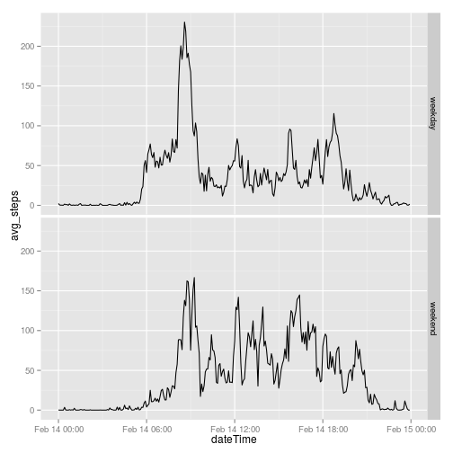

## Loading and preprocessing the data
Using read.csv to load the orignal measured data.

```r
path <- "activity.csv"
activityMeasuredD<- read.csv(file = path
                             , sep = ","
)  
```

Summary of activityMeasuredD:

```
##      steps                date          interval     
##  Min.   :  0.00   2012-10-01:  288   Min.   :   0.0  
##  1st Qu.:  0.00   2012-10-02:  288   1st Qu.: 588.8  
##  Median :  0.00   2012-10-03:  288   Median :1177.5  
##  Mean   : 37.38   2012-10-04:  288   Mean   :1177.5  
##  3rd Qu.: 12.00   2012-10-05:  288   3rd Qu.:1766.2  
##  Max.   :806.00   2012-10-06:  288   Max.   :2355.0  
##  NA's   :2304     (Other)   :15840
```

Convert measured data to analytical data.  

1. Convert the values in date column into date type  
2. Fill up the values in column intervall up to 4 character by adding 0 on the left side(using sprint() - function)     
3. Add a new column dataTime by mergeing column date and interval (using strptime() -funktion)  


```r
activityAnalyticD <- activityMeasuredD
activityAnalyticD$date <-  as.Date(activityMeasuredD$date, format = "%Y-%m-%d")
# add leadin 0 to intervall
activityAnalyticD$interval <- sprintf("%04d", activityMeasuredD$interval)
dateTimeStr <- paste(activityMeasuredD$date, sprintf("%04d", activityMeasuredD$interval))

activityAnalyticD$dateTime <- strptime(dateTimeStr, "%Y-%m-%d %H%M") # as.Date(activityMeasuredD$date,"
```


## What is mean total number of steps taken per day?

### Calulate total number of steps taken per day

1. Load dplyr Package to calculate stepsPerDay
2. Group by date and aggreate over steps
3. Rename the columns of data.frame stepsPerDay


```r
# library(dplyr)
# ignor NAs by caluclation
stepsPerDay <-  aggregate(activityAnalyticD$steps, by=list(activityAnalyticD$date), FUN=sum, na.rm=TRUE)
names(stepsPerDay) <- c("date","sum_steps")
```

### Histogram of the total number of steps taken each day

```r
# open output file
#png(filename="stepsPerDay")
# plot
hist(x <- stepsPerDay$sum_steps,
     main = "Steps taken per day",
     xlab = "total number (steps)",
     ylab = "Frequency" #, col = "red"
)
```



```r
# close output
#dev.off()
```


### Mean and median of  total number of steps taken per day

```r
meanStepsPerDay <-  mean(stepsPerDay$sum_steps)
medianStepsPerDay <-  median(stepsPerDay$sum_steps)
```

- Mean of total number of steps taken per day: 9354.2295082 steps
- Median of total number of steps taken per day: 10395 steps


## What is the average daily activity pattern?

1. agregate over interval and compute the mean for each interval group
2. Rename the columns of data.frame avgDayProfil
3. Convert the values in interval column into date type 

```r
# library(dplyr)
avgDayProfil <-  aggregate(activityAnalyticD$steps, by=list(activityAnalyticD$interval), FUN=mean, na.rm=TRUE)
names(avgDayProfil) <- c("interval","avg_steps")
avgDayProfil$dateTime <- strptime(avgDayProfil$interval , "%H%M") 
```

### Time series plot of the 5-minute interval over the average number of steps taken, across all days

- blue horizontal lines to indicate time range of high activity 
- read horizontal lines to indicate the 5-minute interval with the (average) maximum number of steps 

```r
plot(x=avgDayProfil$dateTime, y=avgDayProfil$avg_steps, type="l", lwd=3,
     xlab="time", 
     ylab="avg number (steps)", 
     main = "avg number of steps accross all days"
)
# add horizontal lines to indicate high activity
abline(v=as.numeric(strptime(format(Sys.time(), "%Y-%m-%d 08:00" ),"%Y-%m-%d %H:%M")),col=4,lty=2)
abline(v=as.numeric(strptime(format(Sys.time(), "%Y-%m-%d 09:10" ),"%Y-%m-%d %H:%M")),col=4,lty=2)
# mark maximum number of steps with a red vertical line
abline(v=as.numeric(strptime(format(Sys.time(), "%Y-%m-%d 08:35" ),"%Y-%m-%d %H:%M")),col=2,lty=1)
```



### Maximum number of step in 5-minute interval, on average across all the days in the datasets

```r
highActiv <-  avgDayProfil[order(-avgDayProfil$avg_steps),]
## highest Value
maxActivityInterval <- format(highActiv[1,]$dateTime,"%H:%M")
```

- The maximum number is in 5-minute interval on: 08:35  


## Imputing missing values

### Calculate the total number of missing values in the dataset

```r
countNA <- sum(is.na(activityMeasuredD))
```

- In total there are 2304 rows with missing values (NA)

### Filling in all of the missing values in the dataset 

- First I create a copy of the original measured data
- clean up intervall 

```r
activityAnalyticDnoNA <- activityMeasuredD
activityAnalyticDnoNA$date <-  as.Date(activityAnalyticDnoNA$date, format = "%Y-%m-%d")
# add leadin 0 to intervall
activityAnalyticDnoNA$interval <- sprintf("%04d", activityMeasuredD$interval)
dateTimeStr <- paste(activityAnalyticDnoNA$date, sprintf("%04d", activityMeasuredD$interval))
activityAnalyticDnoNA$dateTime <- strptime(dateTimeStr, "%Y-%m-%d %H%M") # a
```


- Missing values are all in column steps. So I need a strategy to fill them up.
I uses the mean for that 5-minute interval calulated above (avgDayProfil) to fill them up. 
- In order to keep the orignal data I add a new column stepsNoNA which hold the steps and did not contain NA 

```r
# add a new collumn called stepsNoNA which contains no NA
activityAnalyticDnoNA$stepsNoNA <-  activityMeasuredD$steps
# fill up NA
for (i in which(is.na(activityAnalyticDnoNA$steps)))
{
  int <- activityAnalyticDnoNA$interval[i]
  activityAnalyticDnoNA$stepsNoNA[i]<- avgDayProfil[avgDayProfil$interval==int,]$avg_steps
}  
```

### Calculate the total number of steps taken each day without NA

1. Load dplyr Package to calculate stepsPerDay
2. Group by date and aggreate over steps
3. Rename the columns of data.frame stepsPerDay

```r
# library(dplyr)
# total number of steps per no NA
stepsPerDaynoNA <-  aggregate(activityAnalyticDnoNA$stepsNoNA, by=list(activityAnalyticDnoNA$date), FUN=sum)
names(stepsPerDaynoNA) <- c("date","sum_steps")
```

### Histogram of the total number of steps taken each day without NA

```r
# open output file
#png(filename="stepsPerDay")
# plot
hist(x <- stepsPerDaynoNA$sum_steps,
     main = "Steps taken per day (without NA)",
     xlab = "total number (steps)",
     ylab = "Frequency" #, col = "red"
)
```




### Mean and median of  total number of steps taken per day without NA

```r
meanStepsPerDay <-  mean(stepsPerDaynoNA$sum_steps)
medianStepsPerDay <-  median(stepsPerDaynoNA$sum_steps)
```

- Mean of total number of steps taken per day without NA: 1.0766189 &times; 10<sup>4</sup> steps
- Median of total number of steps taken per day without NA: 1.0766189 &times; 10<sup>4</sup> steps

The mean and median value calculation without NA differ from the mean and median value calulated with NA.

## Are there differences in activity patterns between weekdays and weekends?

### Create a new factor variable in the dataset with two levels: weekday, weekend 

1. Add factor variable, the weekdays coded as numbers (1=monday,..., 7= sunnday)
2. Change factor vaiable and merge all weedays together and all weekends together

```r
# add factor Variabel
activityAnalyticDnoNA$partOfWeek <- as.factor(format(activityAnalyticDnoNA$date,'%u'))
# Change levels:
levels(activityAnalyticDnoNA$partOfWeek ) <- list(
  weekday = c(1,2,3,4,5), # Monday, Tuesday, Wednesday, Thursday, Friday
  weekend = c(6,7) # Saturday, Sunday
)
```

### Time series plot of the 5-minute interval and the average number of steps taken, averaged
across all weekday days or weekend days (y-axis). 

- Calulate the profile


```r
avgDayProfilnoNA <- aggregate(activityAnalyticDnoNA$stepsNoNA, by=list(activityAnalyticDnoNA$interval,activityAnalyticDnoNA$partOfWeek), FUN=mean, na.rm=TRUE)
names(avgDayProfilnoNA ) <- c("interval","partOfWeek","avg_steps")
avgDayProfilnoNA $dateTime <- strptime(avgDayProfilnoNA $interval , "%H%M") 
```

- Plot the  graph


```r
library(ggplot2)
plot <- ggplot(avgDayProfilnoNA,  aes(x= dateTime, y= avg_steps))+  geom_line(dotsize=  0.4)+  facet_grid(partOfWeek ~ .)
plot
```



